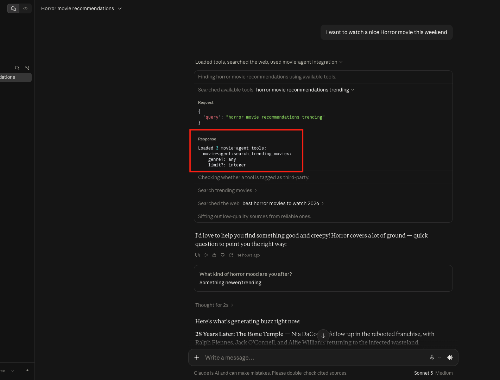
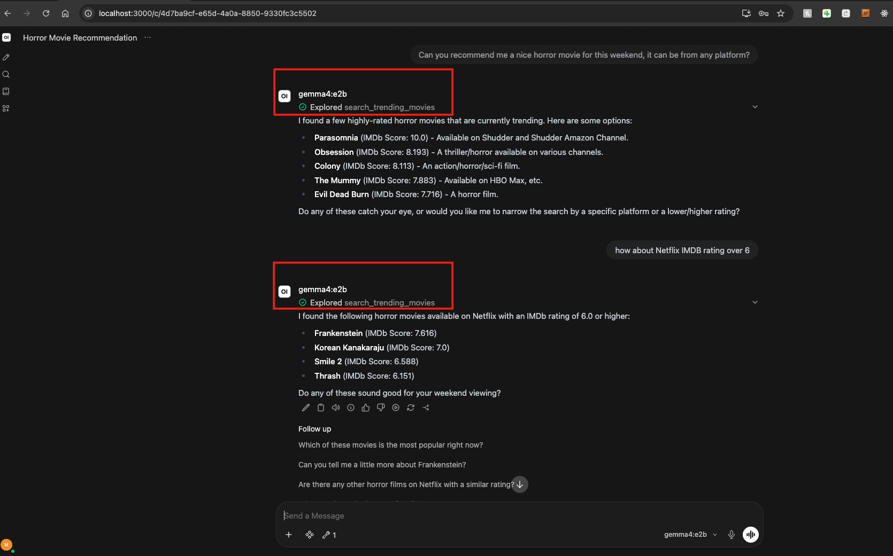

# UK Trending Movie Agent MCP

---

## ✨ Features

* **Dual-Protocol Support**: Exposes both a standard **FastAPI REST API** (with auto-generated `openapi.json`) and an **MCP v2 SSE Server** on a single port (`8000`).
* **Multi-Client Architecture**: Supports **Open WebUI (Docker)** via HTTP REST/OpenAPI schemas AND **Claude Desktop** via native MCP protocol.
* **UK-Specific Movie Intelligence**: Filters trending films by IMDb rating, genre, and UK streaming availability (Netflix, Amazon Prime Video, Disney+, Apple TV+, etc.).
* **Dynamic Schema Generation**: Generates `openapi.json` on disk automatically at startup for one-click import into Open WebUI.

---

## 📋 Prerequisites

* **Python 3.13+**
* **Docker Desktop** (if using Open WebUI)
* **Claude Desktop App** (if using Claude Sonnet 5)
* **TMDB** API Key (for fetching trending movie data)
* **Supported LLMs**:
  * **Ollama local models**: `gemma4:e2b` (verified)
  * **Claude Desktop**: **Claude Sonnet 5** (verified)

---

## 🚀 Installation & Setup

### 1. Environment Setup

Clone or navigate to the project workspace and set up your virtual environment:

```bash
cd /Users/matt/Projects/workspace-py/movie_agent_mcp
python -m venv .venv
source .venv/bin/activate
pip install -r requirements.txt
```

### 2. Database Initialization
Ensure your SQLite database (movies.db) is populated:

```
python db_sync.py
```

### 3. Running the Unified Server
Start the dual REST / MCP server:

```
python unified_server.py
```

Upon startup, the server will:
* Listen on http://0.0.0.0:8000.
* Automatically write openapi.json to the project root.
* Expose the MCP SSE endpoint at http://localhost:8000/sse.


## Client Integrations
### 1. Claude Desktop App Setup
To use Claude Sonnet 5 with your movie database tools:

Open or create your Claude Desktop config file:
```
code ~/Library/Application\ Support/Claude/claude_desktop_config.json
```

### 2. Add the MCP server configuration:
```JSON
{
  "mcpServers": {
    "movie-agent": {
      "command": "/Users/matt/Projects/workspace-py/movie_agent_mcp/.venv/bin/python",
      "args": [
        "/Users/matt/Projects/workspace-py/movie_agent_mcp/unified_server.py"
      ]
    }
  }
}
```

### 3. Restart the Claude Desktop App. 
The hammer icon in Claude will confirm the tools 
(search_trending_movies, list_available_platforms, get_subscription_pricing) are loaded.

### 2. Open WebUI Integration

User(Left bottom) -> Settings -> (Tools) Integrations -> External Tool Servers -> Click Add+
Name: Movie Agent
Description: Movie Agent
url: http://host.docker.internal:8000

Select Model -> Tools -> Make the tool default


## 🧪 Testing & Verification
Check the endpoints directly from your terminal:
```
# Verify REST OpenAPI schema
curl http://localhost:8000/openapi.json

# Test database movie search
curl "http://localhost:8000/search_trending_movies?genre=horror&min_rating=7.0"

# Verify MCP SSE stream connection
curl http://localhost:8000/sse
```

## Sonnet


## Gemma4

