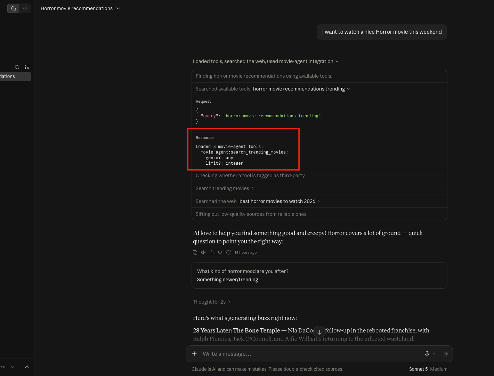
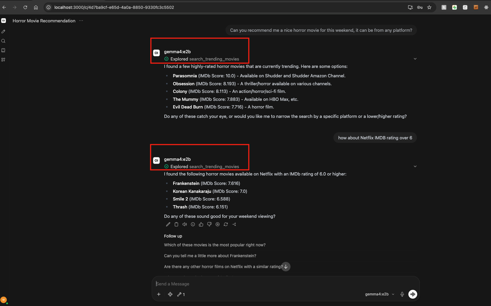

# UK Trending Movie Agent MCP

---

## ✨ Features

* **Dual-Protocol Support**: Exposes both a standard **FastAPI REST API** (with auto-generated `openapi.json`) and an **MCP v2 SSE Server** on a single port (`8000`).
* **Multi-Client Architecture**: Supports **Open WebUI (Docker)** via HTTP REST/OpenAPI schemas AND **Claude Desktop** via native MCP protocol.
* **UK-Specific Movie Intelligence**: Filters trending films by IMDb rating, genre, and UK streaming availability (Netflix, Amazon Prime Video, Disney+, Apple TV+, etc.).
* **Dynamic Schema Generation**: Generates `openapi.json` on disk automatically at startup for one-click import into Open WebUI.

---

## 📋 Prerequisites

* **Python 3.13+**
* **Docker Desktop** (if using Open WebUI)
* **Claude Desktop App** (if using Claude Sonnet 5)
* **TMDB** API Key (for fetching trending movie data)
* **Open WebUI admin API key** (only for automatic Open WebUI registration via `setup_clients.py`)
* **Supported LLMs**:
  * **Ollama local models**: `gemma4:e2b` (verified)
  * **Claude Desktop**: **Claude Sonnet 5** (verified)

---

## 🚀 Installation & Setup

### 1. Environment Setup

Clone or navigate to the project workspace and set up your virtual environment:

```bash
cd /Users/matt/Projects/workspace-py/movie_agent_mcp
python -m venv .venv
source .venv/bin/activate
pip install -r requirements.txt
```

### 2. Database Initialization
Ensure your SQLite database (movies.db) is populated:

```
python db_sync.py
```

### 3. Running the Unified Server
Start the dual REST / MCP server:

```
python unified_server.py
```

Upon startup, the server will:
* Listen on http://0.0.0.0:8000.
* Automatically write openapi.json to the project root.
* Expose the MCP SSE endpoint at http://localhost:8000/sse.

### 4. Register with Claude Desktop & Open WebUI

```bash
python setup_clients.py
```

Adds this server to both Claude Desktop and Open WebUI in one run. See [Client Integrations](#client-integrations) below for details and manual setup.


## Client Integrations

### Automatic setup (recommended)

`setup_clients.py` registers the server with Claude Desktop and/or Open WebUI in one step:

```bash
# Add to both Claude Desktop and Open WebUI
python setup_clients.py

# Other actions
python setup_clients.py status            # show registration status for both
python setup_clients.py remove            # remove from both
python setup_clients.py add --skip-openwebui   # Claude Desktop only
python setup_clients.py add --skip-claude      # Open WebUI only
```

Open WebUI registration needs an admin API key (Settings -> Account -> API Keys). Put it in `local.env` (gitignored) as `OPENWEBUI_API_KEY=...`, pass `--openwebui-token`, or let the script prompt for it.

Restart Claude Desktop after running the script; the hammer icon will confirm the tools (`search_trending_movies`, `list_available_platforms`, `get_subscription_pricing`) are loaded.

### Manual setup

#### Claude Desktop

Open or create your Claude Desktop config file:
```
code ~/Library/Application\ Support/Claude/claude_desktop_config.json
```

Add the MCP server configuration — note the `--stdio` flag, which runs the server over stdio instead of binding port 8000:
```JSON
{
  "mcpServers": {
    "movie-agent": {
      "command": "/Users/matt/Projects/workspace-py/movie_agent_mcp/.venv/bin/python",
      "args": [
        "/Users/matt/Projects/workspace-py/movie_agent_mcp/unified_server.py",
        "--stdio"
      ]
    }
  }
}
```

Restart the Claude Desktop App. The hammer icon in Claude will confirm the tools are loaded.

#### Open WebUI

User (bottom left) -> Settings -> (Tools) Integrations -> External Tool Servers -> Click Add+
Name: Movie Agent
Description: Movie Agent
url: http://host.docker.internal:8000

Select Model -> Tools -> Make the tool default


## 🧪 Testing & Verification
Check the endpoints directly from your terminal:
```
# Verify REST OpenAPI schema
curl http://localhost:8000/openapi.json

# Test database movie search
curl "http://localhost:8000/search_trending_movies?genre=horror&min_rating=7.0"

# Verify MCP SSE stream connection
curl http://localhost:8000/sse
```

## Sonnet


## Gemma4

